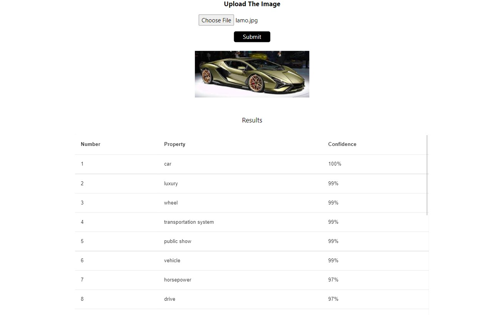

# Clarfai Project

## Introduction
In this project we will be using Clarifai's API to show characteristic of the images. 
 

The clarifai API is a powerful machine learning API that can be used to detect objects, faces, and concepts in images and much more.
  

The images were uploaded by user and it is sent to cloudinary to generate a url and then the url is send to backend.  

Here backend is made using Node.js it uses Clarfai API to get the characteristic of the images.

